# 💳간단 요구사항

1. **skeleton** 코드 : 순수HTML과 JavaScript, Promise 기반으로 동작.
- 사용자가 결제를 완료하면 서버의 /toss/confirm-payment로 결제 **정보 전달**.
- 주문하는 물품의 Id와 이름을 <ID>-<이름> 형식으로 연결해 orderName으로 지정되어 **결제 요청**이 진행됨. (결제 정보 조회시 사용)


2. 전달받은 결제 정보를 바탕으로 결제 **승인 요청**을 Toss로 보냄


3. 어떤 물품이 결제되었는지, 해당 물품의 Toss 결제 정보는 무엇인지가 포함된 주문 정보를 **데이터베이스에 저장**.


4. 결제가 진행되었던 주문 정보들을 **전체, 또는 단일 조회** 가능


5. 주문 정보들의  **Toss 결제 정보**에 대한 **개별 조회** 가능


6. 주문 정보들의 결제에 대하여 **개별 취소** 가능


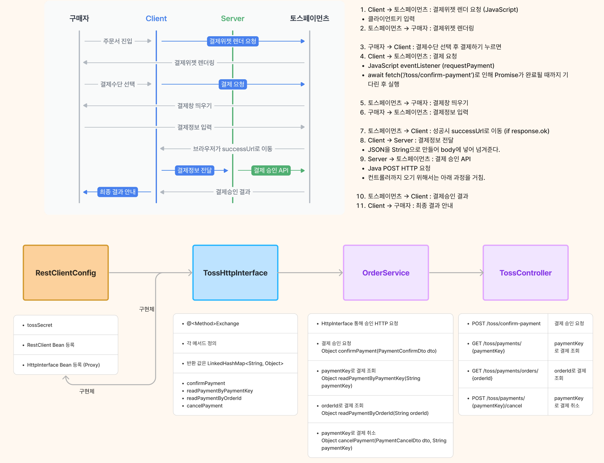

# 구현 기능 확인

#### 1. 결제 승인 및 결제 취소 
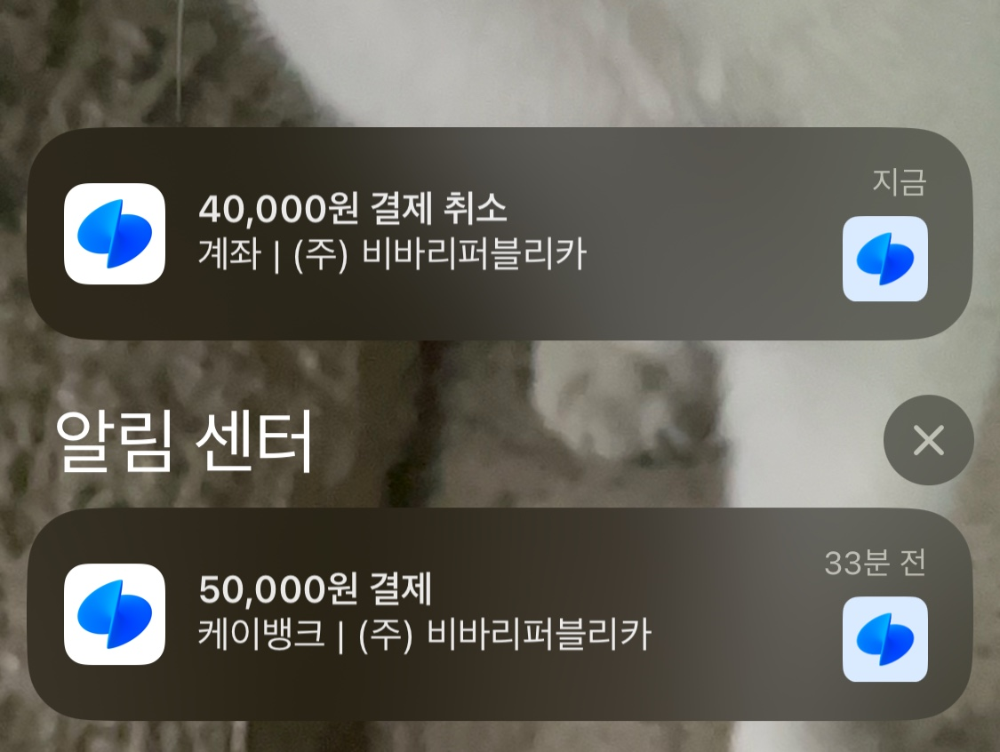
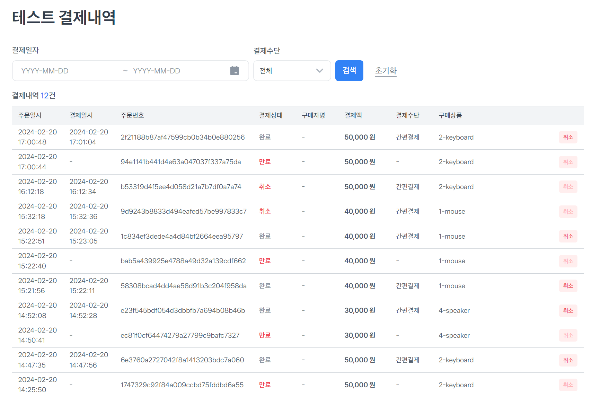
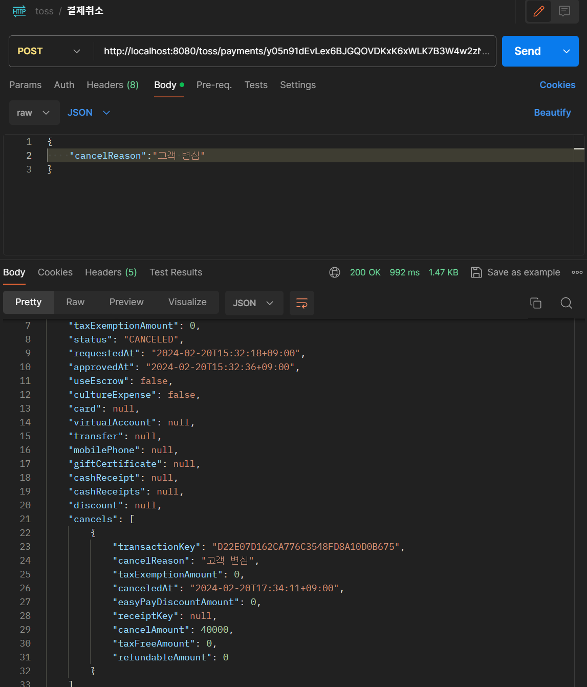

#### 2. 전체 주문내역 조회 
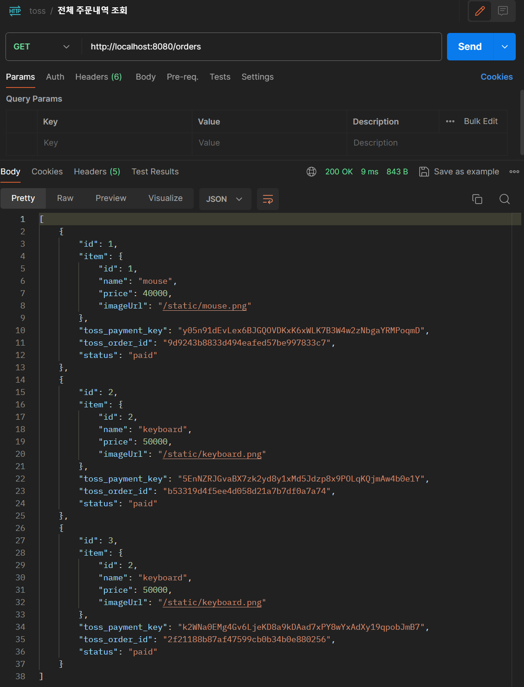

#### 3. 단일 주문내역 조회 (orderId)
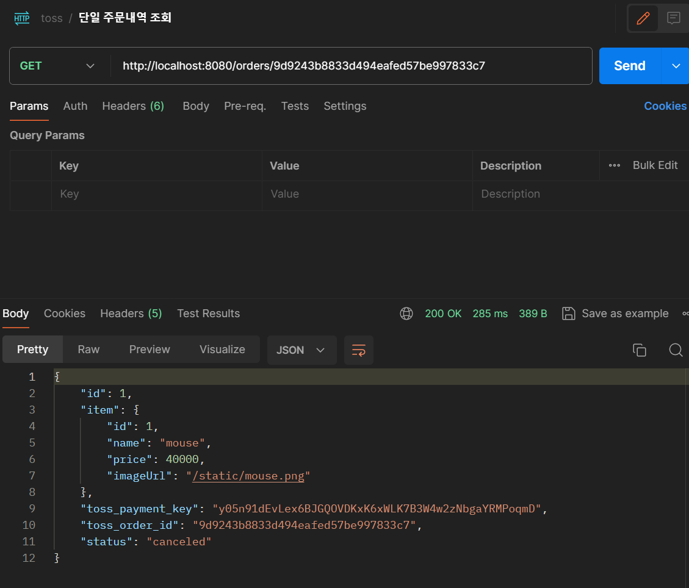

#### 4. 단일 결제내역 조회 (paymentKey)
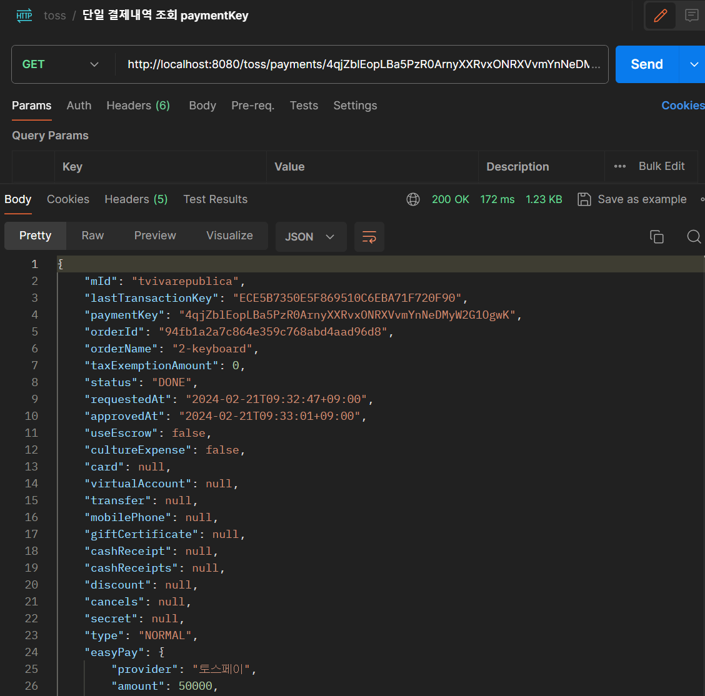

#### 5. 단일 결제내역 조회 (orderId)
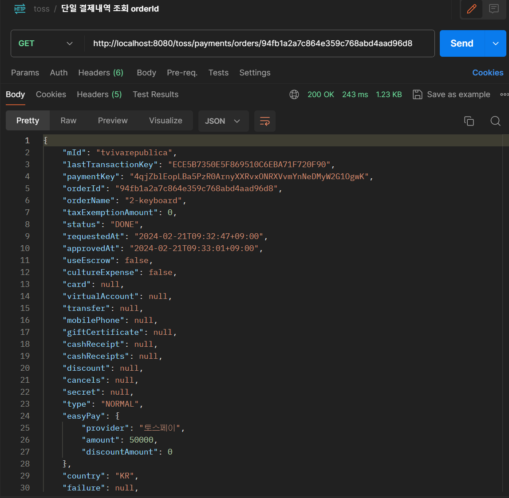


# 🔫트러블 슈팅

### 1. 전체 결제 정보 조회 시 <No Serializer found for class 예외발생>

#### 1차 시도 : Item - ItemOrder (1:N)의 관계 -> Dto에 **Item 객체**를 넣었다. 

```java
@Data
@Builder
@AllArgsConstructor
@JsonNaming(PropertyNamingStrategies.SnakeCaseStrategy.class)
public class ItemOrderDto {
    private Long id;
    private Item item;
    private String tossPaymentKey;
    private String tossOrderId;
    private String status;

    //static factory method
    public static ItemOrderDto fromEntity(ItemOrder entity) {
        return ItemOrderDto.builder()
                .id(entity.getId())
                .tossOrderId(entity.getTossOrderId())
                .tossPaymentKey(entity.getTossPaymentKey())
                .status(entity.getStatus())
                .item(entity.getItem())
                .build();
    }
}
```
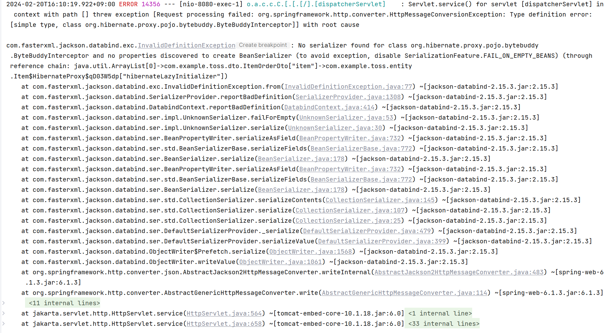
- 이러한 오류가 났다. 
- Object 타입에서 Json으로 직렬화 하는 과정에서 Item이라는 ItemOrderDto안의 객체 타입을 Serialize하면서 문제가 발생했다.
- @Getter는 이미 존재하는데 왜 안되지? 하고 찾은 방법이 @JsonIgnore 어노테이션 붙이기


#### 2차 시도 : Item 필드에 **@JsonIgnore** 붙이기
```java
@Data
@Builder
@AllArgsConstructor
@JsonNaming(PropertyNamingStrategies.SnakeCaseStrategy.class)
public class ItemOrderDto {
private Long id;
@JsonIgnore
private Item item;
private String tossPaymentKey;
private String tossOrderId;
private String status;

    public static ItemOrderDto fromEntity(ItemOrder entity) {
        return ItemOrderDto.builder()
                .id(entity.getId())
                .tossOrderId(entity.getTossOrderId())
                .tossPaymentKey(entity.getTossPaymentKey())
                .status(entity.getStatus())
                .item(entity.getItem())
                .build();
    }
}
```
결과가 이렇게 나왔다. 
> 여기서 문제는 Item 정보가 주문정보에 나와야 하는데 나오지 않는 것. @JsonIgnore는 직렬화 과정에서 빼는 것이기 때문에 근본적인 해결책이 아니다.

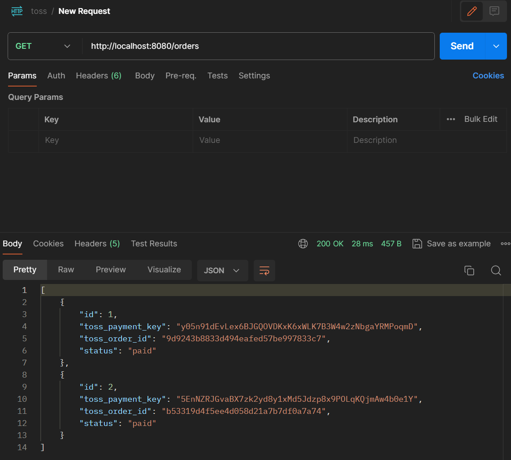


### 그렇다면 Item 객체를 넣지 말자.

#### 3차 시도 : 필드에 Item 객체가 아닌 ItemName만 넣자

```java
@Data
@Builder
@AllArgsConstructor
@JsonNaming(PropertyNamingStrategies.SnakeCaseStrategy.class)
public class ItemOrderDto {
    private Long id;
    private String itemName;
    private String tossPaymentKey;
    private String tossOrderId;
    private String status;

    public static ItemOrderDto fromEntity(ItemOrder entity) {
        return ItemOrderDto.builder()
                .id(entity.getId())
                .tossOrderId(entity.getTossOrderId())
                .tossPaymentKey(entity.getTossPaymentKey())
                .status(entity.getStatus())
                .itemName(entity.getItem().getName())
                .build();
    }
}
```

결국 entity Item 객체에서 getName()을 하여 itemName만 넣기. 결과는 잘 넣어져서 나왔다. 그렇지만 뭔가 아쉬웠다. 
주문정보를 알아야 하는데 Item이 있었으면 하는 아쉬움.

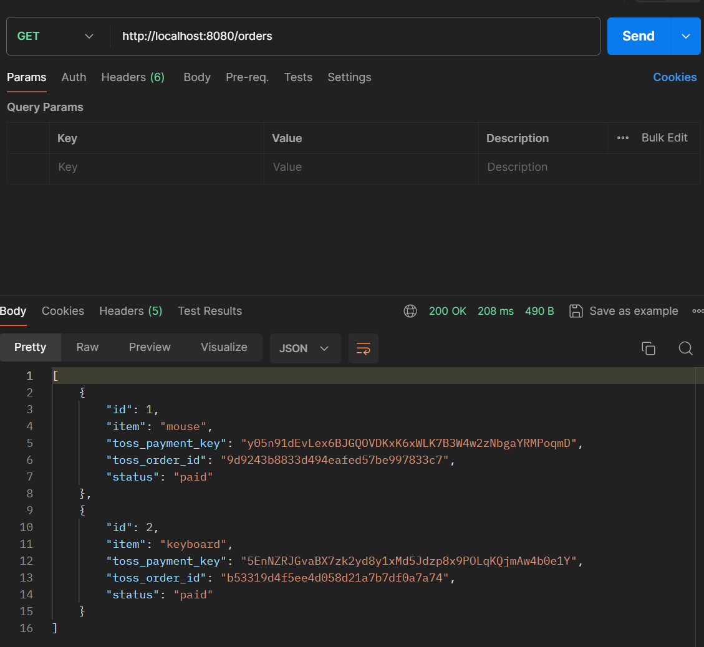

### ItemDto를 넣으면 어떨까!?

#### 4차 시도 : 필드에 ItemDto로 넣자

```java
@Data
@Builder
@AllArgsConstructor
@JsonNaming(PropertyNamingStrategies.SnakeCaseStrategy.class)
public class ItemOrderDto {
    private Long id;
    private ItemDto item;
    private String tossPaymentKey;
    private String tossOrderId;
    private String status;

    public static ItemOrderDto fromEntity(ItemOrder entity) {
        return ItemOrderDto.builder()
                .id(entity.getId())
                .tossOrderId(entity.getTossOrderId())
                .tossPaymentKey(entity.getTossPaymentKey())
                .status(entity.getStatus())
                .item(ItemDto.fromEntity(entity.getItem()))
                .build();
    }
}
```

결과는 이렇게 나왔다. 너무 복잡하게 들어가나 싶기는 한데,,,, 일단은 이렇게 마무리지었다. 주문정보 보기에서 Item에 대한 정보를 함께 보는 것이 관리자 입장에서 편하지 않나 싶은 생각이 들었다. 근데 또 제품 id와 이름만 보여줘도 될 것 같기도 하고... 무튼 ! 이렇게 트러블 슈팅 끝.
